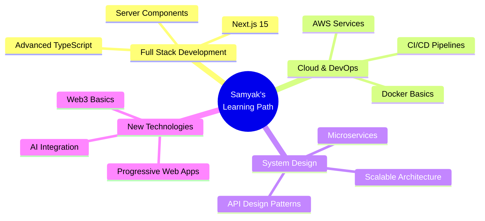

<div align="center">

<!-- Animated Header with Gradient -->


<!-- Typing SVG -->
<a href="https://git.io/typing-svg"></a>

<br/>

<!-- Social Badges with Glow Effect -->
<p align="center">
  <a href="https://www.linkedin.com/in/samyak-thool/">
    
  </a>
  <a href="https://samthool.vercel.app/">
    
  </a>
  <a href="mailto:samthool@outlook.com">
    
  </a>
  <a href="tel:+919370048698">
    
  </a>
</p>

<!-- Profile Views Counter -->


</div>

<br/>

<!-- About Me Section with Animation -->


### 👨‍💻 About Me

```typescript
const samyak = {
    role: "Full-Stack Developer",
    company: "Netline Technologies, Hyderabad",
    experience: "2+ years",
    code: ["JavaScript", "TypeScript", "Java"],
    technologies: {
        frontend: ["React.js", "Next.js", "Redux", "Zustand"],
        backend: ["Node.js", "Express.js", "RESTful APIs"],
        databases: ["MongoDB", "PostgreSQL", "MySQL", "Prisma"],
        styling: ["Tailwind CSS", "Responsive Design"],
        tools: ["Git", "Vercel", "Render", "Postman"]
    },
    currentFocus: "Building scalable full-stack applications",
    passion: "Creating impactful software solutions 🚀"
};
```

<br clear="right"/>

---

<!-- Wave Separator -->


## 💼 Professional Journey

<table>
<tr>
<td width="50%">

### 🏢 Current Role
**Junior Software Developer**  
📍 Netline Technologies, Hyderabad  
📅 Oct 2023 - Present

</td>
<td width="50%">

### 🎯 Key Achievements
✅ Developed HMS, CRM & E-commerce platforms  
✅ Built scalable RESTful APIs  
✅ Integrated Stripe & Cashfree payments  
✅ Managed cloud deployments  

</td>
</tr>
</table>

---

## 🛠️ Tech Arsenal

<div align="center">

### Frontend Mastery
<p>
  
</p>

### Backend Excellence  
<p>
  
</p>

### Database Power
<p>
  
</p>

### DevOps & Tools
<p>
  
</p>

</div>

---

<!-- Animated Divider -->


## 🎨 Featured Projects

<div align="center">

<table>
<tr>
<td width="50%" valign="top">

### 🎂 Smiles Delivery
*Online Cake & Chocolate Ordering Platform*

**Stack:** Next.js • Express.js • MongoDB • Redux  
**Features:** 💳 Payment Gateway • 📧 Email Service • 📱 Responsive

[](https://smiles-delivery-client-git-master-samthools-projects.vercel.app/)
[](https://github.com/SamThool)

</td>
<td width="50%" valign="top">

### 📦 Sunil Cargo
*Cargo & Logistics Service Website*

**Stack:** React.js • Tailwind CSS  
**Features:** 🌐 Custom Domain • ⚡ SEO Optimized • 📱 Responsive

[](https://www.sunilcargo.in/)
[](https://github.com/SamThool)

</td>
</tr>

<tr>
<td width="50%" valign="top">

### 💬 Chat App
*Real-Time Chat Application*

**Stack:** React.js • Express.js • Socket.io • MongoDB  
**Features:** 🔐 JWT Auth • ⚡ Real-time • ☁️ Cloudinary

[](https://chatty-app-yjlu.onrender.com/login)
[](https://github.com/SamThool)

</td>
<td width="50%" valign="top">

### 🎨 Animated Portfolio
*Personal Portfolio with Smooth Animations*

**Stack:** Next.js • TypeScript • Framer Motion  
**Features:** ✨ Animations • 🎭 Interactive • 🎯 Modern UI

[](https://samthool.vercel.app/)
[](https://github.com/SamThool)

</td>
</tr>

<tr>
<td colspan="2" valign="top">

### ⌚ XPAN - Watch E-commerce
*Modern E-commerce Platform (Work in Progress)*

**Stack:** React.js • Node.js • Express.js • Tailwind CSS  
**Features:** 🛒 Shopping Cart • 📊 Admin Panel • 💳 Checkout System

[](https://github.com/SamThool)

</td>
</tr>
</table>

</div>

---

<!-- Animated Divider -->


## 📊 GitHub Analytics

<div align="center">
  
  
</div>

<div align="center">
  
  
</div>

<br/>

<!-- Trophy Section -->
<div align="center">
  
</div>

---

## 🎓 Education & Credentials

<table align="center">
<tr>
<td align="center" width="50%">

### 🎓 Education
**Bachelor of Science**  
*Computer Science*  
📚 RTMNU University  
🏛️ Vidyabharti College, Seloo  
📅 2020 - 2023

</td>
<td align="center" width="50%">

### 📜 Certifications
[](https://www.coursera.org/account/accomplishments/certificate/NWFSVT7RA7Y8)

[](https://www.mygreatlearning.com/certificate/NGCEYCSM)

</td>
</tr>
</table>

---

<!-- Animated Snake -->
<div align="center">
  <picture>
    <source media="(prefers-color-scheme: dark)" srcset="https://raw.githubusercontent.com/SamThool/SamThool/output/github-contribution-grid-snake-dark.svg">
    <source media="(prefers-color-scheme: light)" srcset="https://raw.githubusercontent.com/SamThool/SamThool/output/github-contribution-grid-snake.svg">
    
  </picture>
</div>

---

## 🌱 Current Focus

<div align="center">



</div>

---

## 💡 What Drives Me

<div align="center">

| 🎨 UI/UX Excellence | ⚡ Performance | 🔐 Security | 📱 Responsiveness |
|:-------------------:|:-------------:|:-----------:|:-----------------:|
| Beautiful interfaces that users love | Lightning-fast load times | Secure authentication & payments | Seamless across all devices |

</div>

---

## 📫 Let's Connect & Collaborate!

<div align="center">

### I'm always excited to discuss new projects and opportunities!

<table>
<tr>
<td align="center">
<a href="mailto:samthool@outlook.com">

</a>
</td>
<td align="center">
<a href="https://www.linkedin.com/in/samyak-thool/">

</a>
</td>
<td align="center">
<a href="https://samthool.vercel.app/">

</a>
</td>
<td align="center">
<a href="tel:+919370048698">

</a>
</td>
</tr>
</table>

<br/>

### 💭 *"First, solve the problem. Then, write the code."* — John Johnson

<br/>

<!-- Activity Graph -->


</div>

---

<!-- Footer Wave -->


<div align="center">

### ⭐ Show some love by starring repositories you find interesting!

**Made with ❤️ by Samyak Thool**

</div>
